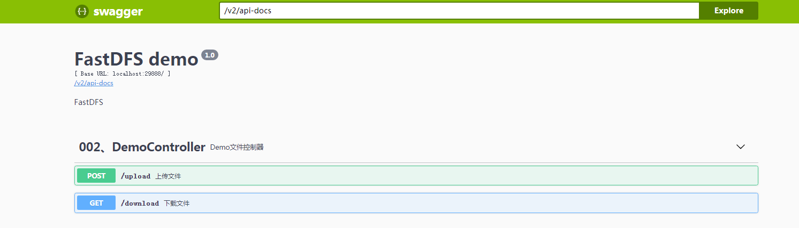

# FastDFS springboot2 demo 


### 项目结构
``` lua
fdfs
├── doc  -- FastDFS 安装部署文档
├── com.gl.common --  公用代码
└── com.gl.fs -- 文件上传下载Demo

```     
 
 ### 引入 fastdfs-spring-boot-starter
 ```xml
         <dependency>
             <groupId>com.luhuiguo</groupId>
             <artifactId>fastdfs-spring-boot-starter</artifactId>
             <version>0.2.0</version>
         </dependency>
 ```
 
 
### starter 配置

```yml

fdfs:
  connect-timeout: 2000
  so-timeout: 3000
  tracker-list:
    - 192.168.1.222:22122
    - 192.168.1.223:22122
```

 JAVA 使用 **FastFileStorageClient**
 
 ```java
   @Autowired
   private FastFileStorageClient storageClient;
 ```


### API 文档地址
      URL:   /docs/index.html 
### API 文档     


### 技术选型
 
 
 技术 | 说明 | 官网
 ----|----|----
 Spring Boot | 容器+MVC框架 | [https://spring.io/projects/spring-boot](https://spring.io/projects/spring-boot)
 Swagger-UI | 文档生产工具 | [https://github.com/swagger-api/swagger-ui](https://github.com/swagger-api/swagger-ui)
 Lombok | 简化对象封装工具 | [https://github.com/rzwitserloot/lombok](https://github.com/rzwitserloot/lombok)

 
###  开发工具
 
 工具 | 说明 | 官网
 ----|----|----
 IDEA | 开发IDE | https://www.jetbrains.com/idea/download
 X-shell | Linux远程连接工具 | http://www.netsarang.com/download/software.html

 
### 开发环境
 
 工具 | 版本号 | 下载
 ----|----|----
 JDK | 1.8 | https://www.oracle.com/technetwork/java/javase/downloads/jdk8-downloads-2133151.html
 Mysql | 5.7 | https://www.mysql.com/
 nginx | 1.10 | http://nginx.org/en/download.html
 
